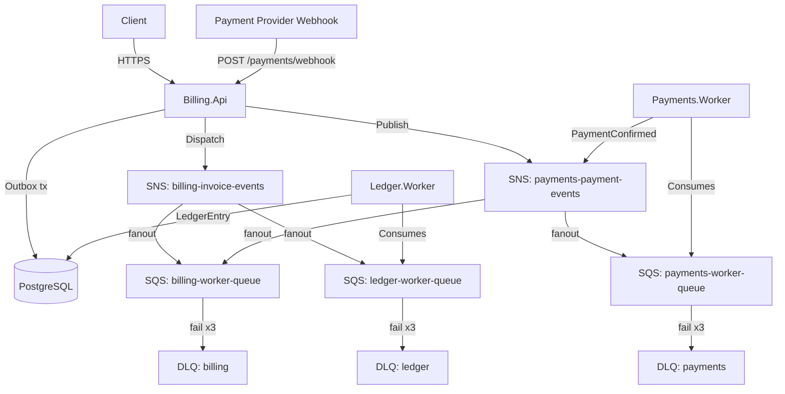

# BillingLedger

[](https://github.com/Lucasantunesribeiro/billing_ledger/actions/workflows/ci.yml)


Backend enterprise-grade event-driven para emissao de cobrancas, processamento de pagamentos e conciliacao via ledger, construido em **.NET 9 / C#** com DDD, Outbox Pattern, idempotencia, mensageria real na AWS e resiliencia para falhas transientes no `Billing.Api`.

## Visao Geral da Arquitetura



## Saga de Pagamento

```text
InvoiceIssued -> PaymentReceived -> PaymentConfirmed -> InvoicePaid -> LedgerEntryCreated
```

Transicao `Overdue` e disparada por job agendado no `Billing.Api`.

## Catalogo de Eventos (V1)

| Evento                 | Publicado por         | Consumido por               | Topico SNS              |
| ---------------------- | --------------------- | --------------------------- | ----------------------- |
| `InvoiceIssuedV1`      | Billing.Api (Outbox)  | Ledger.Worker               | billing-invoice-events  |
| `PaymentReceivedV1`    | Billing.Api (webhook) | Payments.Worker             | payments-payment-events |
| `PaymentConfirmedV1`   | Payments.Worker       | Billing.Api, Billing.Worker | payments-payment-events |
| `InvoicePaidV1`        | Billing.Api (Outbox)  | Ledger.Worker               | billing-invoice-events  |
| `InvoiceOverdueV1`     | Billing.Api (job)     | Ledger.Worker               | billing-invoice-events  |
| `LedgerEntryCreatedV1` | Ledger.Worker         | -                           | -                       |

Todos os eventos incluem `EventId`, `CorrelationId` e `SchemaVersion = 1`.

## Resiliencia de Integracoes

O `BillingLedger.Billing.Api` agora aplica resiliencia em dois pontos de saida:

- **Event bus outbound**: publicacoes feitas pelo `IEventBus` passam por retry exponencial com jitter, timeout por tentativa e circuit breaker antes de chegar ao transporte MassTransit/SNS/SQS.
- **HTTP outbound**: o projeto registra um `HttpClient` nomeado com `Microsoft.Extensions.Http.Resilience`, pronto para webhooks de saida e integracoes REST entre servicos ou workers quando esse fluxo for introduzido.

Em caso de falha transiente de rede, timeout curto ou indisponibilidade temporaria do broker/downstream, o comportamento esperado do `Billing.Api` e:

- tentar novamente operacoes transientemente falhas sem espalhar logica de retry pelos handlers;
- abrir o circuit breaker por uma janela curta quando houver sequencia de falhas;
- manter `retry`, `timeout` e `circuit breaker` configuraveis via `Resilience:EventBus` e `Resilience:DownstreamHttp`.

Exemplo de configuracao:

```json
"Resilience": {
  "EventBus": {
    "MaxRetryAttempts": 3,
    "BaseDelay": "00:00:00.250",
    "MaxDelay": "00:00:03",
    "AttemptTimeout": "00:00:10"
  },
  "DownstreamHttp": {
    "Retry": {
      "MaxRetryAttempts": 3,
      "Delay": "00:00:00.500",
      "BackoffType": "Exponential",
      "UseJitter": true
    },
    "CircuitBreaker": {
      "SamplingDuration": "00:00:30",
      "FailureRatio": 0.5,
      "MinimumThroughput": 5,
      "BreakDuration": "00:00:15"
    }
  }
}
```

## Schemas do Banco (PostgreSQL)

| Schema     | Responsavel      | Conteudo                       |
| ---------- | ---------------- | ------------------------------ |
| `billing`  | Billing.Api      | `invoices`                     |
| `payments` | Payments.Worker  | `payment_attempts`             |
| `ledger`   | Ledger.Worker    | `ledger_entries`               |
| `infra`    | Todos            | `outbox_messages`, `audit_logs`|

## Como Rodar Localmente

### Pre-requisitos

- Docker e Docker Compose
- .NET 9 SDK
- `awslocal` (`pip install awscli-local`) para interagir com LocalStack

> **Nota:** o Postgres do Docker usa a porta **5433** no host para evitar conflito com instalacoes locais na porta padrao `5432`.

### Atalho: setup automatico (Windows/PowerShell)

```powershell
.\tools\setup.ps1
```

Esse script sobe os containers, aplica todas as migrations e imprime os tokens JWT para teste.

### Setup manual

#### 1. Subir a infraestrutura

```bash
docker compose up -d
```

Aguarde todos os healthchecks ficarem `healthy`, principalmente o LocalStack.

#### 2. Aplicar migrations EF Core

```bash
# Billing context
dotnet ef database update --project src/BillingLedger.Billing.Api

# Payments context
dotnet ef database update --project src/BillingLedger.Payments.Worker

# Ledger context
dotnet ef database update --project src/BillingLedger.Ledger.Worker
```

#### 3. Rodar os servicos

```bash
# Terminal 1 - API
dotnet run --project src/BillingLedger.Billing.Api

# Terminal 2 - Payments Worker
dotnet run --project src/BillingLedger.Payments.Worker

# Terminal 3 - Ledger Worker
dotnet run --project src/BillingLedger.Ledger.Worker
```

Swagger disponivel em `http://localhost:5082/swagger`.

#### 4. Exemplo de fluxo completo

```bash
# 1. Criar invoice (draft)
curl -X POST http://localhost:5082/api/invoices \
  -H "Authorization: Bearer <token>" \
  -H "Content-Type: application/json" \
  -d '{"customerId":"00000000-0000-0000-0000-000000000001","amount":150.00,"currency":"BRL","dueDate":"2026-04-01"}'

# 2. Emitir invoice
curl -X POST http://localhost:5082/api/invoices/{id}/issue \
  -H "Authorization: Bearer <token>"

# 3. Simular pagamento recebido (webhook autenticado via HMAC-SHA256)
BODY='{"invoiceId":"{id}","externalPaymentId":"pix-abc123","provider":"PIX","amount":150.00}'
SIG="sha256=$(echo -n "$BODY" | openssl dgst -sha256 -hmac 'test-secret' | awk '{print $2}')"
curl -X POST http://localhost:5082/api/payments/webhook \
  -H "X-Webhook-Signature: $SIG" \
  -H "Content-Type: application/json" \
  -d "$BODY"
```

## Testes

```bash
# Todos os testes
dotnet test

# Apenas unitarios
dotnet test tests/BillingLedger.Billing.UnitTests

# Teste especifico
dotnet test --filter "FullyQualifiedName~Invoice_ShouldTransitionToPaid"

# Integracao (requer Docker)
dotnet test tests/BillingLedger.IntegrationTests
```

Teste unitario focado na resiliencia do barramento:

```bash
dotnet test tests/BillingLedger.Billing.UnitTests --filter "FullyQualifiedName~ResilientEventBusTests"
```

## Deploy AWS (Milestone 3)

Consulte [`docs/runbook.md`](docs/runbook.md) para instrucoes completas de deploy, operacao e troubleshooting em producao.

```bash
cd infra
npm install
npx cdk bootstrap
npx cdk deploy --all
```

## Decisoes Arquiteturais

- **PostgreSQL schemas separados por BC**: um unico cluster RDS com schemas `billing`, `payments`, `ledger` e `infra`, mantendo isolamento logico sem overhead de multiplos bancos.
- **Outbox Pattern**: eventos publicados atomicamente na mesma transacao da mudanca de estado; dispatcher com `SKIP LOCKED` garante processamento seguro em paralelo.
- **MassTransit sobre SNS/SQS**: abstracao que permite `InMemory` em testes e `SQS` em producao via feature flag `Messaging:Transport`.
- **Resiliencia no Billing.Api**: `ResilientEventBus` protege publish outbound com retry exponencial, timeout e circuit breaker; `AddStandardResilienceHandler` prepara clientes HTTP para webhooks e callbacks de saida.
- **HMAC-SHA256 no webhook**: provedores externos autenticam via assinatura do payload; JWT nao e usado em endpoints de webhook.
- **Secrets Manager no ECS**: credenciais nunca em variaveis de ambiente em texto plano; sao injetadas via `secrets` no task definition.

## Threat Model (resumo)

| Ameaca               | Mitigacao                                                                      |
| -------------------- | ------------------------------------------------------------------------------ |
| Replay de pagamento  | Unique index `(provider, external_payment_id)` + idempotencia no handler       |
| Double spending      | Transicao de estado idempotente na Invoice; estado verificado antes de aplicar |
| Spoofing de webhook  | Validacao de assinatura HMAC no endpoint `/payments/webhook`                   |
| Privilege escalation | JWT + RBAC via policies por endpoint; claims validados no middleware           |
| Exposicao de erros   | ProblemDetails sem stack trace em producao; logs estruturados internos         |
