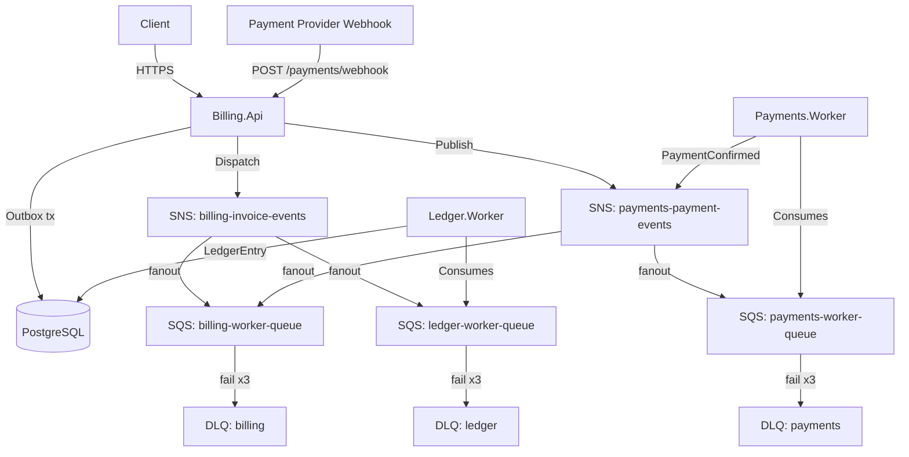

# BillingLedger

Backend enterprise-grade event-driven para emissão de cobranças, processamento de pagamentos e conciliação via ledger, construído em **.NET 9 / C#** com DDD, Outbox Pattern, idempotência e mensageria real na AWS.

---

## Visão Geral da Arquitetura



## SAGA de Pagamento

```
InvoiceIssued → PaymentReceived → PaymentConfirmed → InvoicePaid → LedgerEntryCreated
```

Transição `Overdue` é disparada por job agendado no `Billing.Api`.

## Catálogo de Eventos (V1)

| Evento                 | Publicado por         | Consumido por               | Tópico SNS              |
| ---------------------- | --------------------- | --------------------------- | ----------------------- |
| `InvoiceIssuedV1`      | Billing.Api (Outbox)  | Ledger.Worker               | billing-invoice-events  |
| `PaymentReceivedV1`    | Billing.Api (webhook) | Payments.Worker             | payments-payment-events |
| `PaymentConfirmedV1`   | Payments.Worker       | Billing.Api, Billing.Worker | payments-payment-events |
| `InvoicePaidV1`        | Billing.Api (Outbox)  | Ledger.Worker               | billing-invoice-events  |
| `InvoiceOverdueV1`     | Billing.Api (job)     | Ledger.Worker               | billing-invoice-events  |
| `LedgerEntryCreatedV1` | Ledger.Worker         | —                           | —                       |

Todos os eventos incluem `EventId`, `CorrelationId` e `SchemaVersion = 1`.

## Schemas do Banco (PostgreSQL)

| Schema     | Responsável     | Conteúdo                        |
| ---------- | --------------- | ------------------------------- |
| `billing`  | Billing.Api     | `invoices`                      |
| `payments` | Payments.Worker | `payment_attempts`              |
| `ledger`   | Ledger.Worker   | `ledger_entries`                |
| `infra`    | Todos           | `outbox_messages`, `audit_logs` |

## Como Rodar Localmente

### Pré-requisitos
- Docker e Docker Compose
- .NET 9 SDK
- `awslocal` (pip install awscli-local) — para interagir com LocalStack

### 1. Subir a infraestrutura

```bash
docker compose up -d
```

Aguarde todos os healthchecks ficarem `healthy` (especialmente LocalStack ~30s).

### 2. Aplicar migrações EF Core

```bash
# Billing context
dotnet ef database update --project src/BillingLedger.Billing.Api

# Payments context
dotnet ef database update --project src/BillingLedger.Payments.Worker

# Ledger context
dotnet ef database update --project src/BillingLedger.Ledger.Worker
```

### 3. Rodar os serviços

```bash
# Terminal 1 — API
dotnet run --project src/BillingLedger.Billing.Api

# Terminal 2 — Payments Worker
dotnet run --project src/BillingLedger.Payments.Worker

# Terminal 3 — Ledger Worker
dotnet run --project src/BillingLedger.Ledger.Worker
```

Swagger disponível em: `https://localhost:5001/swagger`

### 4. Exemplo de fluxo completo (curl)

```bash
# 1. Criar invoice (draft)
curl -X POST https://localhost:5001/api/invoices \
  -H "Authorization: Bearer <token>" \
  -H "Content-Type: application/json" \
  -d '{"customerId":"00000000-0000-0000-0000-000000000001","amount":150.00,"currency":"BRL","dueDate":"2026-04-01"}'

# 2. Emitir invoice
curl -X POST https://localhost:5001/api/invoices/{id}/issue \
  -H "Authorization: Bearer <token>"

# 3. Simular pagamento recebido (webhook)
curl -X POST https://localhost:5001/api/payments/webhook \
  -H "Authorization: Bearer <token>" \
  -H "Content-Type: application/json" \
  -d '{"invoiceId":"{id}","externalPaymentId":"pix-abc123","provider":"PIX","amount":150.00}'
```

## Testes

```bash
# Todos os testes
dotnet test

# Apenas unitários
dotnet test tests/BillingLedger.Billing.UnitTests

# Teste específico
dotnet test --filter "FullyQualifiedName~Invoice_ShouldTransitionToPaid"

# Integração (requer Docker)
dotnet test tests/BillingLedger.IntegrationTests
```

## Deploy AWS (Milestone 3)

Consulte [`infra/README.md`](infra/README.md) para instruções completas de deploy via CDK TypeScript.

```bash
cd infra
npm install
npx cdk bootstrap
npx cdk deploy --all
```

## Decisões Arquiteturais

Consulte [`docs/adr/`](docs/adr/) para todos os ADRs. Highlights:

- **ADR-001**: PostgreSQL single instance com schemas separados por BC (vs. múltiplos bancos)
- **ADR-002**: Outbox Pattern obrigatório para garantia de publicação de eventos
- **ADR-003**: LocalStack em dev (sem in-memory transport) para paridade com prod
- **ADR-004**: MassTransit como abstração de mensageria sobre SNS/SQS

## Threat Model (resumo)

| Ameaça               | Mitigação                                                                      |
| -------------------- | ------------------------------------------------------------------------------ |
| Replay de pagamento  | Unique index `(provider, external_payment_id)` + idempotência no handler       |
| Double spending      | Transição de estado idempotente na Invoice; estado verificado antes de aplicar |
| Spoofing de webhook  | Validação de assinatura HMAC no endpoint `/payments/webhook`                   |
| Privilege escalation | JWT + RBAC via policies por endpoint; claims validados no middleware           |
| Exposição de erros   | ProblemDetails sem stack trace em produção; logs estruturados internos         |
